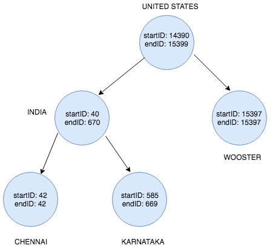

# Distributor Problem 

The problem statement can be viewed [here](https://github.com/realimage/challenge2016).

- [Requirements](#Requirements) 
- [Project Structure](#Project-Structure)
- [Program Execution](#Program-Execution?)
- [Operations Supported](#Operations-Supported)
- [Input Format](#Input-Format) 
- [Output Format](#Output-Format)
- [Algorithm](#Algorithm)
- [Algorithm Analysis](#Algorithm-Analysis) 

## **Requirements**

- python 3.5 or above

    If you don't have python 3 in your system, you can download and install it from [here](https://www.python.org/downloads/)

- termcolor (python module)
    
    It is used to get the output in color text for easy understanding. If you don't have termcolor in your system's python modules, you can install it with the help of this command `pip install termcolor` 

    *`If the program is being executed on a UNIX-based system, color text will work fine. In windows-based system, the text may not be colored, instead a color code will be displayed.`*

## **Project Structure**
The project files are laid out in a straightforward manner as there are only few program files. 

    -- Distributor Problem
        -- src
            -- app.py
            -- Tree.py
            -- Utility.py
        -- input.txt
        -- README.md
        -- sampleInput.pdf 
        -- Dataset
            -- cities.csv 
        -- Images
            -- output1.png
            -- output2.png
            -- WorldTree.png
            


## **Program Execution**
The entry point for running this application is app.py. Enter the following python command on the terminal after navigating to the /src directory.

` 
python app.py
`

## **Operations Supported**

The program supports two operations as follows: 

        - Adding Permission
        - Checking whether a Distributor has access to a particular region

## **Input Format** 

I have chosen to give the input to the program through a text file called `input.txt` for the ease of interaction. But, along with it, there comes some rules. The rules are as follows: 

- The syntax of adding/checking permission should be strictly followed, which can be viewed in the sampleInput.pdf file. 

- Permission commands should be given only after `###Permissions` line.

- A blank line should be left in between a set of permission commands for each distributor.
    
    **Example**

    ``` 
    PERMISSIONS FOR D1
    INCLUDE: INDIA

    PERMISSIONS FOR D2 < D1
    INCLUDE: TAMILNADU-INDIA
    EXCLUDE: CHENNAI-TAMILNADU-INDIA
    ```  

- Don't leave space in between the name of a place like `TAMIL NADU`, instead give it like this `TAMILNADU`. 

- EXCLUDE commands should always follow only after the INCLUDE commands in setting the permission for a distributor. 

    **Example**
    ```
    PERMISSIONS FOR D4
    INCLUDE: INDIA
    INCLUDE: KARNATAKA-INDIA
    EXCLUDE: KANCHIPURAM-TAMILNADU-INDIA
    ```   

- Check commands should be given only after the `###CHECK PERMISSIONS` line.

- Blank lines should not be left between two subsequent check commands 

    **Example** 

    ```
    ### CHECK PERMISSIONS
    D1 INDIA
    D2 CHENNAI-TAMILNADU-INDIA
    ```

**NOTE**: If you accidentally collapse the input.txt file, sampleInput.pdf file will save you by taking you back to the track. 

**NOTE TO THE PROBLEM SETTER**: 
    
I have made some changes to the input format, which are  as follows: 

- In the problem statement, some of the words in the input are given in lowercase like `Permissions for Distributor1` which I have changed to `PERMISSIONS FOR DISTIBUTOR1`. I have made this change just to keep the typing at ease, instead of tapping the caps lock button often to switch cases. 

- Simplified the command `PERMISSIONS D3 < D2 < D1` to `PERMISSIONS D3 < D2`, as my program understands that D2 is a subset of D1 from the previous commands.


## **Output Format**

Output will be displayed in the terminal along with the input, when app.py is executed. 

## **Algorithm**

This section will talk about few areas of the algorithm which dominates the space and running time of the program.

- Places of the world recorded in cities.csv are stored in a tree data  structure. I will reference that data structure hereafter as `World Tree`. Each place will have two ID's - startID and endID. The ID's are assigned by following a pattern. The pattern can be viewed in the following diagram.
    
    <br>
    <br>
    <br>

    
                    
    <center> The World Tree diagram is created using draw.io </center>


    It can be evidently seen that the child node's startID and endID is always within the range of the parent node's startID and endID. This ID scheme helps us to find whether a province Y is within a country X or a city Z in within a province Y easily. 

    **Example**
        
        INDIA => startID - 40; endID - 670
        TAMIL NADU => startID - 41; endID - 110
        CHENNAI => startID - 42; endID - 42

- Permissions of each distributor is stored in a seperate BST(Binary Search Tree) 

    **Example**

        PERMISSIONS FOR D1
        INCLUDE: UNITEDSTATES
        INCLUDE: INDIA
        INCLUDE: CHENNAI-TAMILNADU-INDIA
        INCLUDE: KARNATAKA INDIA
        INCLUDE: WOOSTER-OHIO-UNITEDSTATES
    
    The INCLUDE Permissions of D1 is stored in the tree as in the below diagram. 

    <br>
    <br>

     
    
    <center> The above diagram is created using draw.io </center>

    <br>

    The nodes will be inserted based on the following condition: 
    - If the startID of the node to be inserted is less than the mid value of the current node's start and end ID, then the node will be inserted to its left.
    - If the startID of the node to be inserted is equal or greater than the mid value of the current node's start and end ID, then the node will be inserted to its right. 

    `NOTE`: EXCLUDE permissions will also be stored in a separate BST just like INCLUDE permissions. 


## **Algorithm Analysis**

### **World Tree Analysis**

**Properties**

- Technically, it's a n-array Tree. 
- The height of the tree is always 3. 


**Trade-offs**

- The node structure is as follows:

    ```
    startID: Integer
    endID: Integer
    children: Dictionary()
    ```

    **Argument**: `children` can be made List(), but it dominates the running-time in finding out the desired node. To put it in numbers, there are 195 countries in the world, so in the worst-case, it will take 195 iterations to find out the desired country node. Likewise, the same can be applied down the hierarchy for provinces in a country and cities in a province. I preferred to relax the space and give way for better running-time. My opinion can be reversed based on the requirement of the application. 


**Analysis**

**Space Complexity - O(n)**, where n is the number of places recorded in cities.csv file. 

**Time Complexity - O(1)**, traversing the tree in both depth-wise and breadth-wise is constant, because the depth of the tree is constant(height of the tree is 3) and traversing breadth-wise is also constant due to the nature of Dictionary(), which return the value of a key in O(1). 

**Time Complexity for creating a tree is O(n)**, due to the constraints of the problem statement, which says not to use a database, we had to create the World Tree every time we run the program. 

### **Binary Search Tree Analysis**

The INCLUDE/EXCLUDE permissions for a distributor is stored in BST for a reason. 

**Trade-off**

- INCLUDE/EXCLUDE permissions for a distributor can be stored in the list, which is as simple as it is. But the real pain comes when a Distributor X assigns permissions to Distributor Y, because before adding the permissions to Distributor Y's permission list, we had to check the permission list of X, which takes O(n) time, where n is the number of permissions of Distributor X. 

- As the algorithm gives ID for every place, we can take advantage of that and store the permissions in a Binary Search Tree by following its property strictly. So that we can check whether the permission can be added to Y or not by checking the Distributor X's permission in O(log n) time. 

    **Argument**:
    The same running time of O(log n) can be achieved by storing it in the list itself and doing a binary search. But, binary search requires the list to be sorted, as there is no guarentee that the permissions will be processed in a sorted order. But, it can be achieved by sorting the list in O(n logn) time after adding the permissions. So the running-time complexity will be O(n logn) + O(logn) = O(n logn). Hence, I chose to use BST, which will not introduce an additional cost of O(n logn) for sorting instead, it uses some overhead space for storing left and right child which can be saved when using list. 
    
    Again, I leave this argument open, because I can't claim which one is the best without knowing the exact requirements and resources of the application.

**Analysis**

**Time Complexity**
- Insertion - O(logn)
- Search - O(log n)

**Space Complexity - O(n)**

Say, k INCLUDE permissions are needed to be assigned to Distributor Y by Distributor X, then it will take O(k logn) time for this operation, where k is the number of permissions to be added to Y's permission list and n is the number of INCLUDE permissions of X.  


